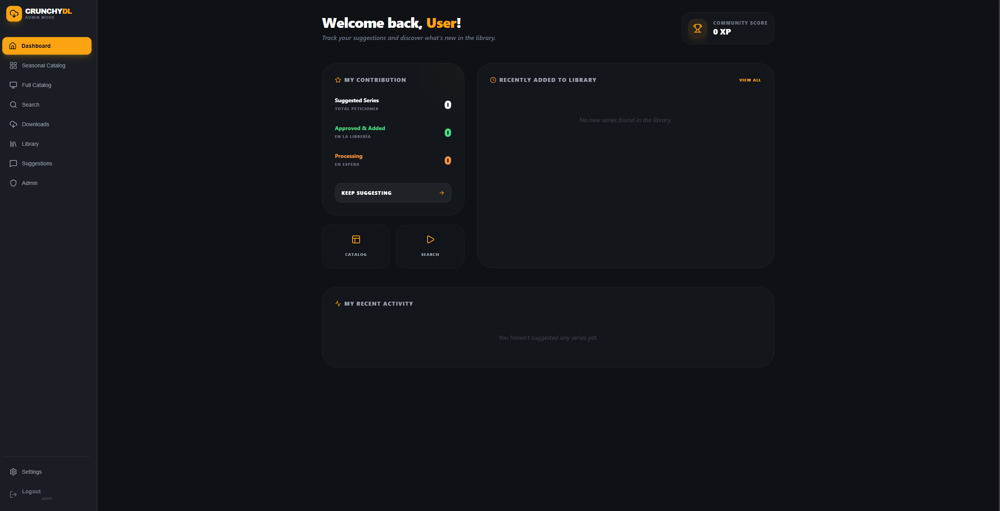

# 🚀 CrunchyDL 

[](https://www.docker.com/)
[](https://reactjs.org/)
[](https://nodejs.org/)
[](https://www.sqlite.org/)
[](https://ko-fi.com/dokman)
[](https://discord.gg/T2kfCRtDEy)

A **premium, community-driven** platform for automated anime management and downloading. Built with a modern, high-performance architecture and a stunning user interface.



---

## ✨ Flagship Features

### 📺 Smart Automation (Smart DL)
- **Sub-per-Sub Catch-up**: Periodic series monitoring. Automatically detects and downloads missing episodes even for late subscriptions.
- **Multilingual Metadata**: Choose your preferred language/region (Spanish, English, etc.) during setup for all series titles and descriptions.
- **Native Internationalization (i18n)**: Fully localized interface in **English** and **Spanish** with automatic browser detection and persistent settings.
- **Cross-Service Sync**: Advanced matching logic that synchronizes catalog metadata (Crunchyroll) with local library storage (AniList/Generic) to prevent duplicate downloads.

### 👥 Governance & Auditing (RBAC)
- **Granular Roles**: Permission management for **Administrators**, **Contributors**, and **Standard Users**.
- **Audit Logs**: Full traceability of all administrative actions.

### 🎨 Premium Experience
- **Interactive Setup Wizard**: A 4-step initial setup to configure your database (SQLite/MySQL), API keys (TMDB/TVDB), and credentials.
- **Modern UI/UX**: Ultra-responsive dark mode interface with fluid micro-animations and integrated image editors.

---

## 🛠️ Quick Start

1.  **Clone the repository**:
    ```bash
    git clone --recursive https://github.com/USER/Crunchyroll-Downloader-Docker.git
    cd Crunchyroll-Downloader-Docker
    ```
2.  **Configure DRM (Optional but recommended)**:
    Place your CDM files in the following folders (created automatically or manually):
    - `widevine/`: Client blob and private key (or `.wvd` file).
    - `playready/`: `bgroupcert.dat` and `zgpriv.dat`.
3.  **Start with Docker**:
    ```bash
    docker-compose up -d
    ```
4.  **Complete the Setup**:
    Visit `http://localhost:3001` and follow the **Setup Wizard** to initialize your administrator account and services.

---

## 💻 Native Installation (Non-Docker)

If you prefer to run the application directly on your host system (Windows or Linux) without Docker, follow these steps:

### 1. Prerequisites
- **Node.js**: v18 or later.
- **FFmpeg**: Must be installed and in your system's PATH.
- **Git**: For cloning and submodules.

### 2. Automatic Setup
We provide helper scripts to automate the build and dependency installation:

**Windows (PowerShell):**
```powershell
.\scripts\setup-native.ps1
```

**Linux (Bash):**
```bash
bash scripts/setup-native.sh
```

### 3. Manual Build (If needed)
1.  **Initialize Submodules**: `git submodule update --init --recursive`
2.  **Frontend Build**: `cd frontend && npm install && npm run build`
3.  **Prepare Backend**: Copy `frontend/dist/*` to `backend/public/`
4.  **Backend Setup**: `cd backend && npm install`
5.  **Submodule Build**: `cd backend/multi-downloader-nx && npm install && npm run tsc false false`
6.  **Start Server**: `cd backend && node index.js`

### 🏃 Quick Start (Post-Setup)
Once the setup is complete, you can start the server using the launchers in the root directory:
- **Windows**: Double-click `run-windows.bat`
- **Linux**: Run `bash run-linux.sh`

Visit `http://localhost:3001` to use the application.

---

## 🔐 DRM & CDM Configuration

This application uses the `multi-downloader-nx` core for decryption. To enable high-quality downloading (1080p+), you must provide your own CDM (Content Decryption Module) files.

- **Widevine**: Recommended for most content. Put your files in the root `/widevine` folder.
- **Playready**: Supported for specific streams. Put your files in the root `/playready` folder.

> [!IMPORTANT]
> **Legal Disclaimer**: This software is intended for personal, educational, and research purposes ONLY. We **do not provide** any copyrighted content, decryption keys, or bypasses for digital rights management. The user is solely responsible for obtaining the necessary credentials and CDM files from their own legal devices and complying with the Terms of Service of any platform accessed.

---

## 🛠️ Tech Stack

| Layer | Technologies |
| :--- | :--- |
| **Frontend** | React 18, Vite, Vanilla CSS, Lucide Icons, i18next |
| **Backend** | Node.js, Express, Undici, FFmpeg |
| **Database** | SQLite (default) / MySQL (optional) |
| **Infrastructure** | Docker & Docker Compose |

---

## ☕ Support the Project

If you like the project and want to support its development, you can buy me a coffee:

[](https://ko-fi.com/dokman)

You can also see our list of amazing [Donors](DONORS.md).

---

## 💬 Community

Join our [Discord Server](https://discord.gg/T2kfCRtDEy) to get support, share suggestions, or just chat with other users!

[](https://discord.gg/T2kfCRtDEy)

---

## 📜 License & Ethics

Licensed under the **PolyForm Noncommercial 1.0.0**. Personal and hobbyist use is permitted; commercial use is strictly prohibited.

See the [LICENSE](LICENSE) file for more details.
